# Liscribe

Liscribe records your voice and transcribes it on your Mac, entirely offline.

---

## The honest bit

This is not a real Mac app. There is no `.app` bundle you drag to your Applications folder. Enrolling in Apple's Developer Program costs $78 a year, and I have not done that. What you get instead is a Python program that runs in your menu bar and looks reasonably native — but you need to install it from Terminal, and you need to open Terminal to launch it until you set up the login item.

If you have never used Homebrew or Python before, setup will feel unfamiliar. It works, but it takes a few minutes and a handful of Terminal commands. The installer handles most of the complexity, and there is an onboarding wizard for the rest. I am being upfront about this so you are not surprised.

---

## Why you might want it

Every transcription service I could find either sends your audio to a server, charges a subscription, or both. Liscribe does neither. The transcription model runs on your machine. Your audio never leaves your computer. There is no account, no API key, no usage limit, and no monthly bill.

It is built on [faster-whisper](https://github.com/guillaumekynast/faster-whisper), which is a fast implementation of OpenAI's Whisper model. The model downloads once from Hugging Face when you first use it. After that, nothing reaches the internet.

---

## What it does

**Scribe** — Records a conversation or meeting. It captures your microphone and, if you have BlackHole installed, the speaker side of the call as well. When you stop, it produces a markdown transcript with speaker labels (in: / out:). Transcripts are saved to `~/transcripts` by default.

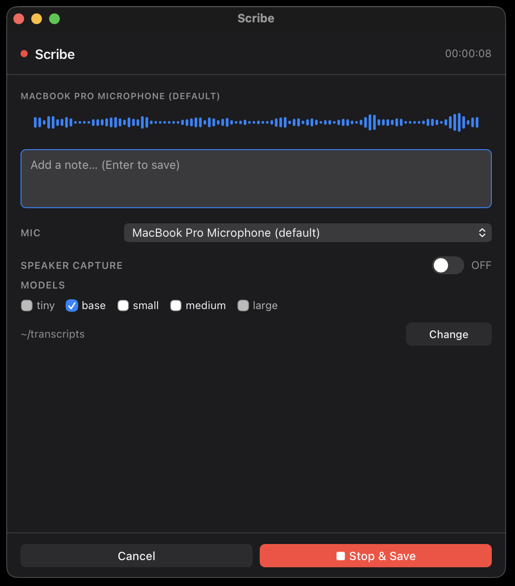

*Scribe recording — waveform, mic selector, optional speaker capture, model choice.*

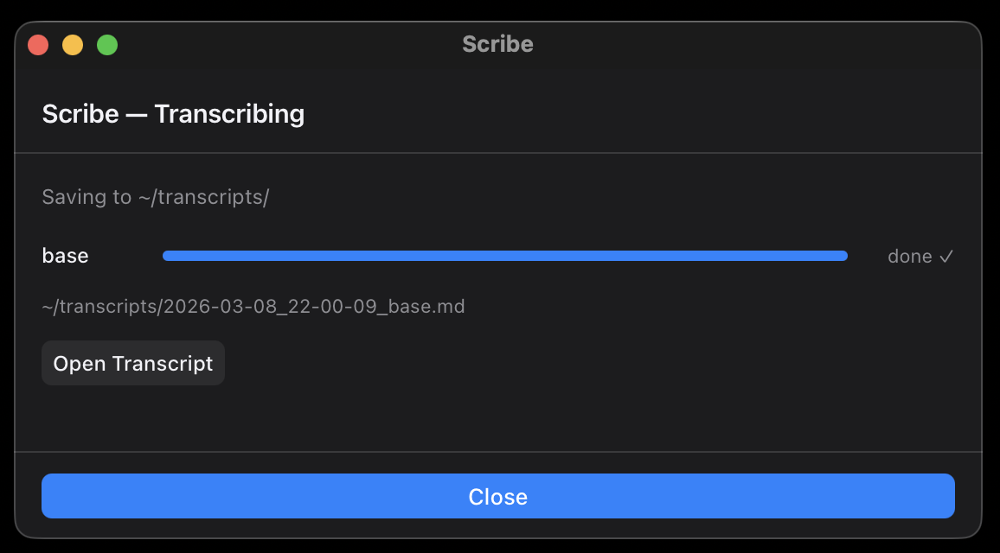

*After you hit Stop & Save, transcription runs locally and the file path appears when done.*

---

**Transcribe** — You already have an audio file and you want a transcript. Drop it in, get text back. Same model, same quality, no recording step.

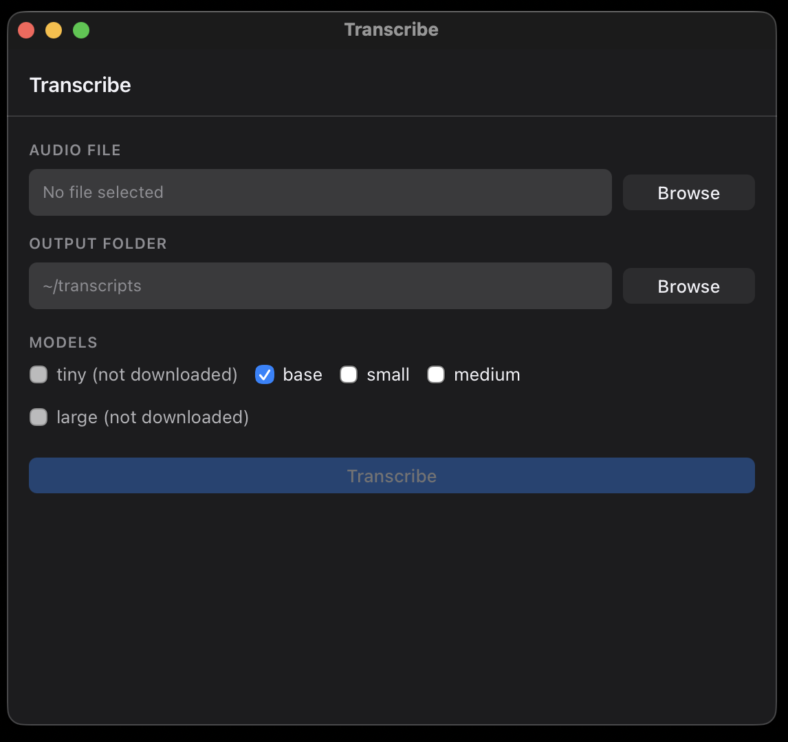

*Pick an audio file, choose an output folder, select a model, hit Transcribe.*

---

**Dictate** — A system-wide dictation shortcut. Double-tap Left Control, speak, and the text is typed into whatever app you are using. This works anywhere on your Mac — any text field, any app.

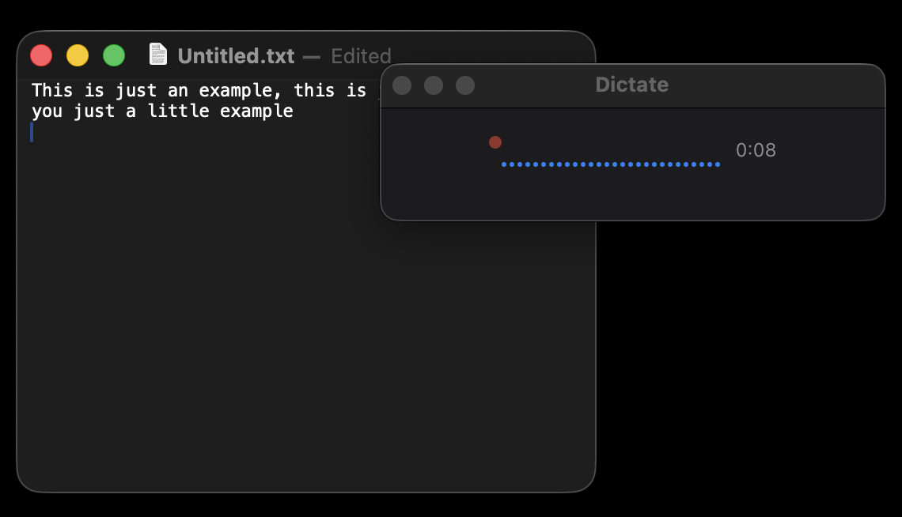

*A small floating window appears while you speak. It stays out of the way and does not steal focus from the app you are typing into.*

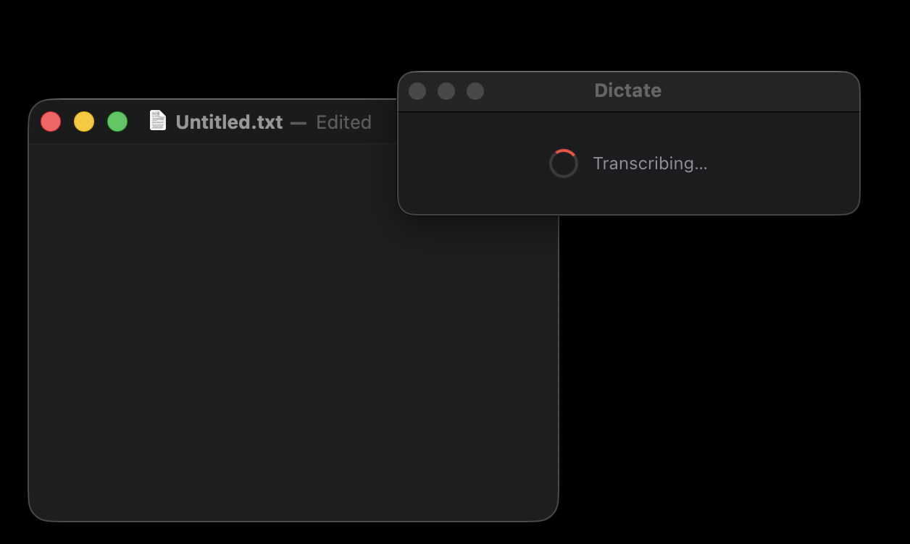

*When you stop, transcription runs in the background.*

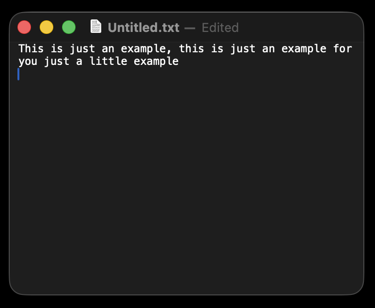

*The transcribed text is pasted directly into wherever your cursor was.*

---

## What you need before you start

- macOS (tested on Sonoma and later)
- Python 3.10 or newer (the installer will check)
- Homebrew (the installer will install it if you do not have it)
- A terminal you are not afraid of

The installer will ask macOS to grant three permissions: Microphone, Accessibility, and Input Monitoring. Accessibility and Input Monitoring are required for Dictate to paste text into other apps. You can use Scribe and Transcribe without them.

If you want to record the speaker side of calls, you also need BlackHole 2ch and a multi-output device in Audio MIDI Setup. The installer can install BlackHole; the steps below walk you through the rest. It is optional.

---

## Install

**Get the repo and open it in Terminal.** Either:

- **Git:** `git clone <repo-url>` (e.g. your fork), then `cd liscribe`
- **Download:** Download the repo as a ZIP from GitHub, unzip it, then open that folder in Terminal. You can right‑click the folder in Finder and choose **Open in Terminal** (or **Services → New Terminal at Folder**), or right‑click while holding Option to **Copy “folder” as Pathname**, then in Terminal run `cd ` and paste. Or type the path from scratch, e.g. `cd ~/Downloads/liscribe-main`

From the liscribe folder, run:

```bash
./install.sh
```

The script will:

- Check for Homebrew and install it if missing
- Install Python dependencies into a virtual environment
- Install PortAudio (required for audio capture)
- Optionally install BlackHole 2ch
- Set up a LaunchAgent so Liscribe starts at login
- Add a `liscribe` alias to your shell config

The install script does not require sudo for most steps. Homebrew and LaunchAgent setup are the exceptions.

---

## How to run it

```bash
liscribe
```

This opens the app window and puts the menu bar icon in place. When you quit the window, Liscribe stays running in the menu bar — click the icon to bring it back. There is no Dock icon while it is in the background.

<p align="center">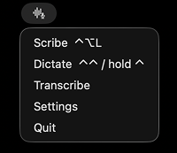</p>

The first time you run it, an onboarding wizard walks you through granting permissions and downloading the transcription model.

---

## Speaker capture setup

Speaker capture records both your microphone and the other side of the call (system audio). To do that, Liscribe needs a **multi-output device** that sends audio to BlackHole (for recording) and to your headphones or speakers (so you can hear the call). You create this once in macOS Audio MIDI Setup; after that, when you are on a call you set the **meeting app’s** speaker/output (e.g. in Google Meet or Teams) to that device.

### 1. Install BlackHole and open Audio MIDI Setup

If you did not install BlackHole during `install.sh`, run:

```bash
brew install --cask blackhole-2ch
```

Then open **Audio MIDI Setup**: press ⌘Space, type `Audio MIDI Setup`, and open the app.

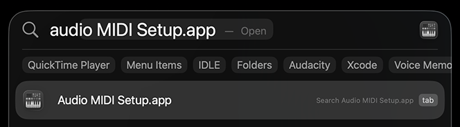

### 2. Create a multi-output device

In the left-hand list, click the **+** button at the bottom and choose **Create Multi-Output Device**.

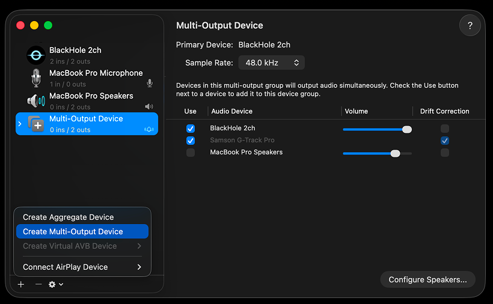

A new entry appears (e.g. “Multi-Output Device”). Click it to show its settings in the right-hand pane.

### 3. Add BlackHole and your headphones (or speakers)

In the device list on the right:

- **Check “Use” next to BlackHole 2ch** — so system audio is sent to Liscribe for recording.
- **Check “Use” next to your headphones or external speakers** — so you hear the call.  
  Your headphones or speakers must be **plugged in** when you do this so they appear in the list. Once you have added them, they stay in the list; you do not need to plug them in again every time.

You can leave **MacBook Pro Speakers** (or built-in speakers) checked if you want to hear from them as well. If you are worried about mic feedback, you can leave them unchecked and use only headphones.

### 4. Name the device and set it in Liscribe

Rename the multi-output device to something you will recognise (e.g. **Liscribe**): click its name in the left-hand list and type the new name.

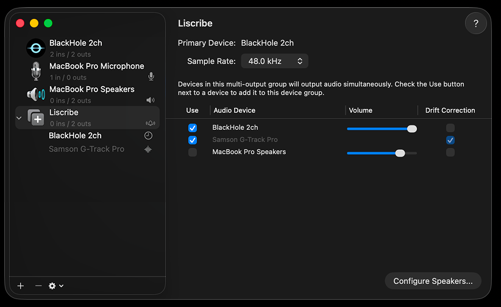

In Liscribe, open **Settings → Dependencies** and set **Speaker output device** to that exact name (e.g. `Liscribe`). That way Liscribe knows which device to switch to when you enable speaker capture.

### 5. When you are on a call

In your call app (e.g. Google Meet or Teams), set the meeting’s **speaker/output** to your multi-output device (e.g. Liscribe). Then start your Scribe recording and turn on **Speaker capture**. Liscribe will switch the system output to your multi-output device if it is not already selected, so you hear the call through the devices you added (e.g. headphones) and the call audio is recorded via BlackHole.

---

## Models

Liscribe uses Whisper models. The default is `base`, which is about 145 MB and works well for most uses. Larger models are more accurate but slower and take more disk space:

| Model  | Size   | Notes                          |
|--------|--------|-------------------------------|
| tiny   | ~75 MB | Fast, less accurate            |
| base   | ~145 MB | Default. Good balance         |
| small  | ~465 MB | Noticeably better accuracy    |
| medium | ~1.5 GB | Accurate, slower on older Macs|
| large  | ~3 GB  | Best quality, needs fast Mac  |

Models are downloaded from Hugging Face and cached at `~/.cache/liscribe`. You can change the model in Preferences.

---

## Data and privacy

Nothing you record or transcribe is ever sent anywhere. The transcription runs locally on your CPU or Apple Silicon Neural Engine. The only outbound network activity is the one-time model download from Hugging Face when you first set up a model. After that, Liscribe does not make any network requests.

Config is stored at `~/.config/liscribe/config.json`. Transcripts go to `~/transcripts` unless you change it in Preferences.

---

## Settings

Preferences covers the save folder, default microphone, hotkeys, text replacements, and model management. There is also a Dependencies tab that shows whether BlackHole and PortAudio are installed correctly.

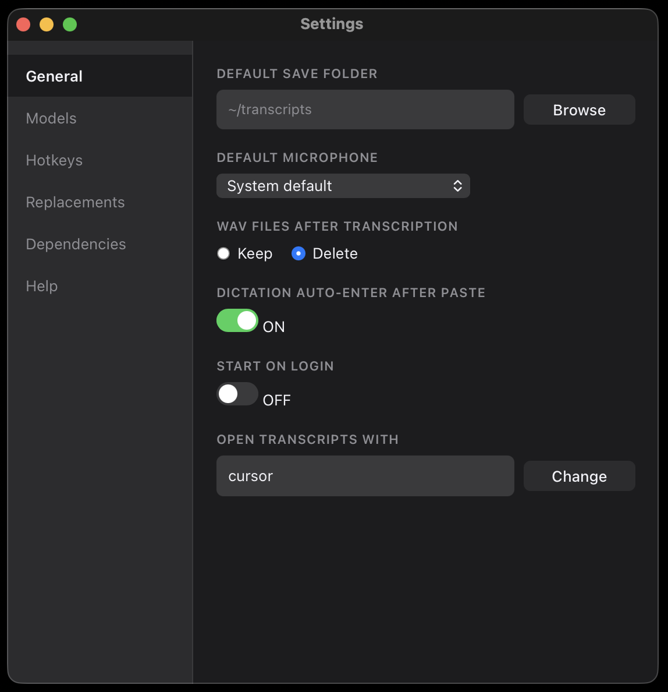

---

## Security

[Security review](docs/security-review.md) — an automated review run by Claude Code in March 2026. No vulnerabilities found.

---

## Uninstall

```bash
./uninstall.sh
```

This removes the LaunchAgent, the shell alias, and the virtual environment. It does not delete your transcripts or the downloaded models — remove `~/.cache/liscribe` manually if you want those gone too.
