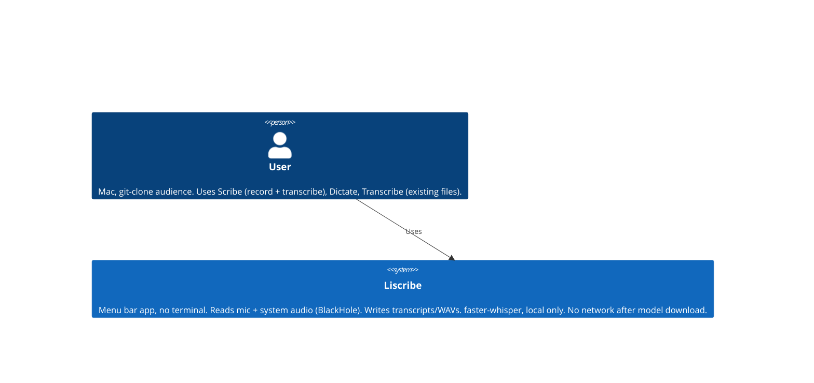
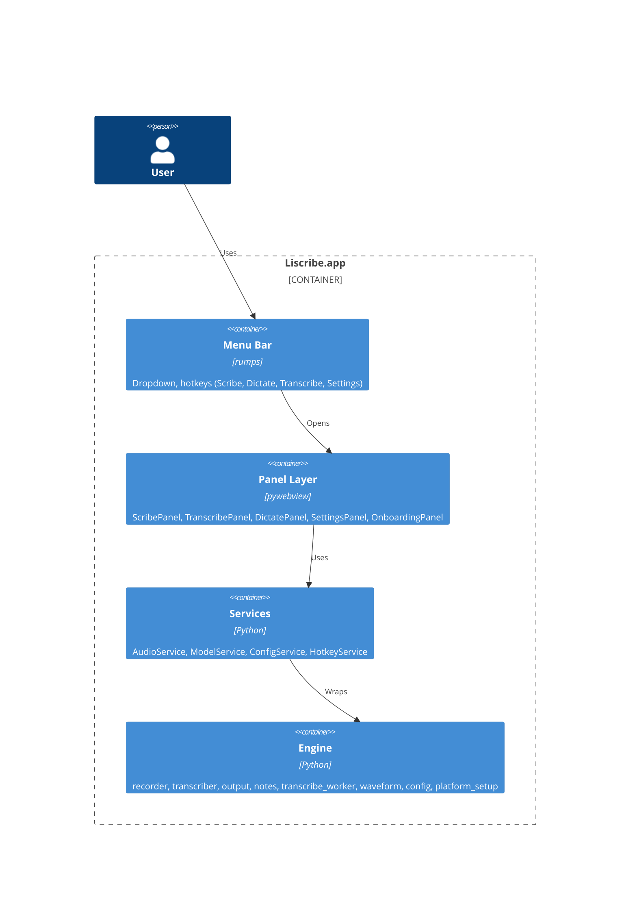
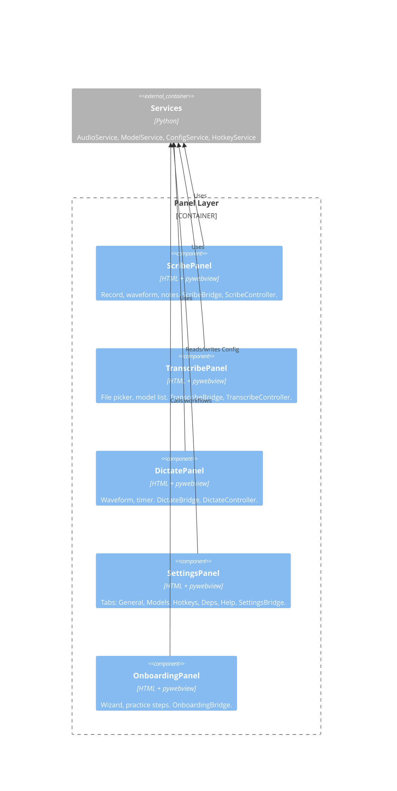

# Liscribe v2 — C4 Architecture

> Defined in Phase 2. Implementation fills in from Phase 3 onward.
> Diagrams use [Mermaid C4](https://mermaid.js.org/syntax/c4.html) (compatible with C4-PlantUML).

---

## Level 1 — System Context

Who uses the system and what the system does.

---

## Level 2 — Container

Major building blocks inside Liscribe.

**Single instance**  
Only one Liscribe process runs per user. A file lock under `~/.cache/liscribe` plus a Unix socket are used so a second launch does not start a duplicate; instead it signals the existing instance to activate (bring to front) and exits. See `app_instance` in the codebase.

---

## Level 3 — Component (Panel Layer)

Components inside the Panel Layer. Each panel follows the same pattern: HTML view, Bridge (JS↔Python), Controller.

---

## Panel contracts and behaviour

Each panel is a self-contained component:

**ScribePanel**
- HTML/CSS view (pywebview)
- ScribeBridge — JS↔Python calls (recording controls, waveform, notes)
- ScribeController — orchestrates AudioService + ModelService

**App–panel contract (Scribe)**  
The app owns Scribe window lifecycle and confirm-close behaviour. It wires four callbacks through ScribeBridge so the panel can trigger app actions:

- **close_panel** — destroy the Scribe window (e.g. after “Leave and discard”).
- **request_close** — trigger the native close flow (same confirm dialog as the red X).
- **transcription_finished** — app sets `confirm_close = False` so the red X closes without prompting.
- **open_in_transcribe** — open Transcribe panel with prefill (from Scribe).

The app sets **confirm_close** on the pywebview window (True while recording/transcribing so the red X shows the confirm dialog; False after transcription is done). The Cocoa backend reads this at close time. This is part of the window contract: see “Window options” below.

**Window options (pywebview)**  
For Scribe, the app passes `confirm_close=True` when creating the window and later mutates `window.confirm_close` (True/False). The pywebview Cocoa layer reads this attribute when the user hits the red X to decide whether to show the “Recording in progress…” dialog. If pywebview changes how confirm works, this contract may need updating.

**Panel load — pywebview API readiness**  
The JS bridge (`pywebview.api`) may not be injectable immediately on `window.load`. Panels that depend on it for initial data (e.g. model list, mic list) should delay the first API call briefly (e.g. 80 ms), then retry once after a short backoff (e.g. 250 ms) if the result is empty. Scribe and Transcribe both use this pattern so the model list and device list populate reliably instead of staying blank.

**TranscribePanel**
- HTML/CSS view
- TranscribeBridge
- TranscribeController — file input → ModelService → output

**DictatePanel** (floating, near cursor)
- HTML/CSS view (minimal: waveform + timer only)
- DictateBridge
- DictateController — hotkey state machine + AudioService + paste

**SettingsPanel**
- HTML/CSS view (tabbed: General, Models, Hotkeys, Deps, Help)
- SettingsBridge
- reads/writes ConfigService directly

**OnboardingPanel**
- HTML/CSS view (stepped wizard)
- OnboardingBridge
- calls real workflows for practice steps

**Shared services (not panels):**
- **AudioService** — wraps recorder.py; one instance, shared across panels
- **ModelService** — wraps transcriber.py; download, load, run
- **ConfigService** — wraps config.py; single source of config truth
- **HotkeyService** — pynput listener; fires callbacks to DictateController and ScribeController
